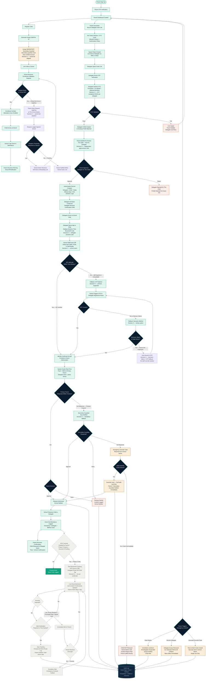

```mermaid
flowchart TD

%% ============================================================
%% SAFEPICK — MASTER SYSTEM FLOWCHART v2.0
%% All decisions from the 9-question clarification session
%% are reflected in this chart.
%% ============================================================

%% ─────────────────────────────────────────
%% BLOCK A: PARENT ONBOARDING
%% ─────────────────────────────────────────

    A1([Parent Sign Up]) --> A2[Phone OTP Verification]
    A2 --> A3[Parent Dashboard Created]

%% ─────────────────────────────────────────
%% BLOCK B: CHILD REGISTRATION
%% Decision #2 — Secondary guardian is MANDATORY
%% ─────────────────────────────────────────

    A3 --> B1[Register Child]
    B1 --> B2[Generate Unique SafePick ID]
    B2 --> B3[Assign MANDATORY Secondary Guardian\nSecondary guardian must have verified account\nDecision 2 — cannot be skipped]
    B3 --> B4[Link Child to School]
    B4 --> B5[School Receives Enrollment Validation Request]

    B5 --> B6{Student Exists\nin School DB?}
    B6 -->|Yes| B7[Enrollment Verified\nAttendance Sync Enabled]
    B6 -->|No — School Not Yet on SafePick| B8[Parent Sees Request SafePick\nat This School Button\nDecision 4 — parent-led adoption]
    B8 --> B9[Request Logged Against School]
    B9 --> B10{Adoption Threshold\nReached for School?}
    B10 -->|Yes| B11[School Admin Receives\nSelf-Serve Onboarding Link]
    B11 --> B5
    B10 -->|No — Pending| B12[Parent Notified When\nSchool Goes Live]

%% ─────────────────────────────────────────
%% BLOCK C: DELEGATE ONBOARDING
%% Decision #3 — One KYC profile, per-child approval
%% ─────────────────────────────────────────

    A3 --> C1[Parent Generates\nSecure Delegate Invite Link]
    C1 --> C2[Set: Expiry Window + KYC Level\nAllowed Children + Authorization Rules]
    C2 --> C3[Signed Token Created\nLink Sent to Delegate via SMS or Share]

    C3 --> C4[Delegate Opens Invite Link]
    C4 --> C5[Delegate Phone OTP Verification]
    C5 --> C6[Delegate Submits KYC:\nFull Name + ID Upload + Optional Biometric\nDecision 3 — KYC completed ONCE per delegate]

    C6 --> C7{KYC Validation}
    C7 -->|Pass| C8[Delegate Profile Created\nor Existing Profile Matched]
    C7 -->|Fail| C9[KYC Failed\nParent Notified\nDelegate Can Retry]
    C9 --> A3

    C8 --> C10[Parent Notified for Review\nPer Child — Not Per Delegate\nDecision 3 — independent approval per child]
    C10 --> C11{Parent Approves\nDelegate for This Child?}
    C11 -->|Approve| C12[Authorization Record Created:\nDelegate + Child + Rules\nAllowed days / time windows / type]
    C11 -->|Reject| C13[Delegate Rejected for This Child\nProfile Retained for Future Use]

    C12 --> C14[Delegate Activation Confirmed\nDelegate Receives Confirmation SMS]

%% ─────────────────────────────────────────
%% BLOCK D: DAILY DROP-OFF / MORNING ATTENDANCE
%% ─────────────────────────────────────────

    B7 --> D1[Child Arrives at School]
    D1 --> D2[School Logs Clock-In Attendance]
    D2 --> D3[Parent Receives Morning\nDrop-Off Notification]

%% ─────────────────────────────────────────
%% BLOCK E: PICKUP FLOW — GATE ARRIVAL
%% Decision #1 — Both school and delegate initiate
%% Decision #5 — All three verification methods supported
%% ─────────────────────────────────────────

    C14 --> E1[Delegate Arrives at School Gate]
    E1 --> E2[Delegate Opens App or PWA\nDisplays Dynamic Time-Bound QR Code\nDecision 1 — delegate presents code]

    E2 --> E3[School Staff Scans QR\nUsing Gate Tablet, Kiosk, or Staff Mobile\nDecision 1 — school scans]

    E3 --> E4{QR Valid and\nWithin Time Window?}

    E4 -->|Yes — QR Verified| E5[Identity Confirmed via QR\nProceed to Parent Authorization]
    E4 -->|No — QR Expired or Unavailable| E6[Fallback: OTP Method\nDecision 5 — all three supported]

    E6 --> E7[School Triggers OTP to\nDelegate Registered Phone]
    E7 --> E8{OTP Correct?}
    E8 -->|Yes| E5
    E8 -->|No or Delivery Failure| E9[Fallback: Biometric Method\nDecision 5 — tertiary option]

    E9 --> E10{Biometric Match\nat Gate Device?}
    E10 -->|Yes| E5
    E10 -->|Fail — Device Not Supported| E11[Auto-Revert to OTP\nDecision 9 — biometric failure = OTP fallback\nNo staff override needed]
    E11 --> E7

%% ─────────────────────────────────────────
%% BLOCK F: PARENT REAL-TIME AUTHORIZATION
%% Decision #2 — Secondary guardian auto-approves if primary unavailable
%% ─────────────────────────────────────────

    E5 --> F1[System Sends Real-Time\nPush + SMS to Primary Parent\nDelegate name + photo shown]

    F1 --> F2{Primary Parent\nResponds Within Timeout?}

    F2 -->|Yes| F3{Parent Decision}
    F3 -->|Approve| F4[Release Authorized\nSchool Notified]
    F3 -->|Deny| F5[Release Denied\nIncident Logged\nSchool Notified]

    F2 -->|No Response — Timeout Expired| F6[Secondary Guardian\nAuto-Notified\nDecision 2 — mandatory fallback]

    F6 --> F7{Secondary Guardian\nResponds?}
    F7 -->|Approve| F4
    F7 -->|Deny| F5
    F7 -->|No Response| F8[Emergency Override Code\nRequired from School Admin]

    F8 --> F9{Valid Override\nCode Entered?}
    F9 -->|Yes| F10[Override Used — Full Audit Log Entry\nParent + Secondary Guardian Notified Immediately]
    F10 --> F4
    F9 -->|No / Code Not Available| F11[Child NOT Released\nSchool Admin Hold\nIncident Report Filed\nParent Called Directly]

%% ─────────────────────────────────────────
%% BLOCK G: SUCCESSFUL RELEASE + ATTENDANCE
%% ─────────────────────────────────────────

    F4 --> G1[School Releases Child to Delegate]
    G1 --> G2[Clock-Out Attendance Logged:\nTimestamp + Delegate + Method Used]
    G2 --> G3[Parent Receives Confirmation:\nChild Released to Delegate Name\nTime + School Confirmation]

%% ─────────────────────────────────────────
%% BLOCK H: GPS MOVEMENT TRACKING
%% Decision #6 — GPS source DEFERRED to Phase 2
%% Architecture placeholder only
%% ─────────────────────────────────────────

    G2 --> H1{GPS Tracking\nEnabled by Parent?\nPhase 2 Feature — Decision 6 Pending}

    H1 -->|No| H2[Process Ends\nEvent Fully Logged]
    H1 -->|Yes — Phase 2 Only| H3[Start Movement Tracking\nGPS Source TBD:\nDelegate Phone OR Child Tag\nDecision 6 — not yet confirmed]

    H3 --> H4[Live Route Monitored\nLast Location Continuously Updated\nParent Views Map in App]

    H4 --> H5{Anomaly\nDetected?}
    H5 -->|No| H6{Safe Destination\nReached or Time Expired?}
    H6 -->|Yes| H7[Stop Tracking\nEncrypt and Store Route Log\nParent Notified: Child Home Safe]
    H6 -->|No| H4

    H5 -->|Yes: Route Deviation / Prolonged Stop / Signal Loss| H8[Immediate Alert to Parent]
    H8 --> H9{Parent Resolves\nAnomaly?}
    H9 -->|Yes| H4
    H9 -->|No — Persists| H10[Escalation Alert\nEmergency Contacts Notified]
    H10 --> H4

%% ─────────────────────────────────────────
%% BLOCK I: AUDIT & INCIDENT LOGGING
%% All terminal events feed the audit log
%% ─────────────────────────────────────────

    F4 --> I1[(Audit Log:\nEvent Type + Actor + Method\nTimestamp + Child ID + Outcome)]
    F5 --> I1
    F10 --> I1
    F11 --> I1
    H7 --> I1

%% ─────────────────────────────────────────
%% BLOCK J: EMERGENCY & PANIC CONTROLS
%% Available to parent at any time
%% ─────────────────────────────────────────

    A3 --> J1{Parent Triggers\nEmergency Control?}
    J1 -->|Panic Button| J2[Immediate Lockdown:\nAll Delegates Suspended\nSchool Notified\nChild Held]
    J1 -->|Revoke Delegate| J3[Delegate Access Removed\nFor Selected Child or All Children\nTakes Effect Immediately]
    J1 -->|Generate Override Code| J4[Time-Limited Code Created\nSecurely Sent to School Admin\nSingle Use Only]

    J2 --> I1
    J3 --> I1
    J4 --> I1

%% ─────────────────────────────────────────
%% STYLING
%% ─────────────────────────────────────────

    classDef decision fill:#0B1A2C,stroke:#0FA37F,stroke-width:2px,color:#FFFFFF
    classDef action fill:#E1F5EE,stroke:#0FA37F,stroke-width:1.5px,color:#0B1A2C
    classDef alert fill:#FAEEDA,stroke:#BA7517,stroke-width:1.5px,color:#0B1A2C
    classDef terminal fill:#0FA37F,stroke:#085041,stroke-width:2px,color:#FFFFFF
    classDef danger fill:#FAECE7,stroke:#D85A30,stroke-width:1.5px,color:#0B1A2C
    classDef deferred fill:#F0EFEA,stroke:#888780,stroke-width:1.5px,color:#444444,stroke-dasharray:6 4
    classDef log fill:#152740,stroke:#0FA37F,stroke-width:2px,color:#9FE1CB

    class B6,B10,C7,C11,E4,E8,E10,F2,F3,F7,F9,H1,H5,H6,H9,J1 decision
    class A1,A2,A3,B1,B2,B4,B5,B7,C1,C2,C3,C4,C5,C6,C8,C10,C12,C14,D1,D2,D3,E1,E2,E3,E5,E6,E7,E9,F1,F4,F6,G1,G2,G3,H4,H8 action
    class B3,F8,F10,J2,J3,J4 alert
    class H2,H7 terminal
    class F5,F11,C9,C13,H10 danger
    class H1,H3,H4,H5,H6,H7,H8,H9,H10 deferred
    class I1 log
    
```