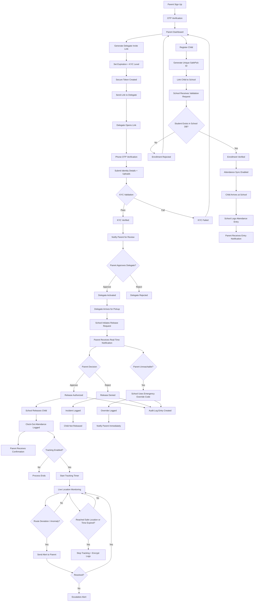

```mermaid
flowchart TD

%% =========================
%% PARENT ONBOARDING
%% =========================

A[Parent Sign Up] --> B[OTP Verification]
B --> C[Parent Dashboard]

%% =========================
%% CHILD REGISTRATION FLOW
%% =========================

C --> D[Register Child]
D --> E[Generate Unique SafePick ID]
E --> F[Link Child to School]
F --> G[School Receives Validation Request]

G --> H{Student Exists in School DB?}

H -->|Yes| I[Enrollment Verified]
H -->|No| J[Enrollment Rejected]
J --> C

I --> K[Attendance Sync Enabled]

%% =========================
%% DELEGATE INVITATION FLOW
%% =========================

C --> L[Generate Delegate Invite Link]
L --> M[Set Expiration + KYC Level]
M --> N[Secure Token Created]
N --> O[Send Link to Delegate]

O --> P[Delegate Opens Link]
P --> Q[Phone OTP Verification]
Q --> R[Submit Identity Details + Uploads]

R --> S{KYC Validation}

S -->|Pass| T[KYC Verified]
S -->|Fail| U[KYC Failed]
U --> C

T --> V[Notify Parent for Review]

V --> W{Parent Approves Delegate?}

W -->|Approve| X[Delegate Activated]
W -->|Reject| Y[Delegate Rejected]

%% =========================
%% DAILY SCHOOL ENTRY FLOW
%% =========================

K --> Z[Child Arrives at School]
Z --> AA[School Logs Attendance Entry]
AA --> AB[Parent Receives Entry Notification]

%% =========================
%% PICKUP AUTHORIZATION FLOW
%% =========================

X --> AC[Delegate Arrives for Pickup]
AC --> AD[School Initiates Release Request]
AD --> AE[Parent Receives Real-Time Notification]

AE --> AF{Parent Decision}

AF -->|Approve| AG[Release Authorized]
AF -->|Reject| AH[Release Denied]

AG --> AI[School Releases Child]
AI --> AJ[Clock-Out Attendance Logged]
AJ --> AK[Parent Receives Confirmation]

AH --> AL[Incident Logged]
AL --> AM[Child Not Released]

%% =========================
%% OPTIONAL MOVEMENT TRACKING
%% =========================

AJ --> AN{Tracking Enabled?}

AN -->|No| AO[Process Ends]

AN -->|Yes| AP[Start Tracking Timer]
AP --> AQ[Live Location Monitoring]
AQ --> AR{Route Deviation / Anomaly?}

AR -->|No| AQ
AR -->|Yes| AS[Send Alert to Parent]

AS --> AT{Resolved?}
AT -->|Yes| AQ
AT -->|No| AU[Escalation Alert]

AQ --> AV{Reached Safe Location or Time Expired?}
AV -->|Yes| AW[Stop Tracking + Encrypt Logs]
AV -->|No| AQ

%% =========================
%% EMERGENCY OVERRIDE FLOW
%% =========================

AE --> AX{Parent Unreachable?}

AX -->|Yes| AY[School Uses Emergency Override Code]
AY --> AZ[Override Logged]
AZ --> BA[Notify Parent Immediately]

%% =========================
%% AUDIT & LOGGING
%% =========================

AG --> BB[Audit Log Entry Created]
AH --> BB
AY --> BB

```